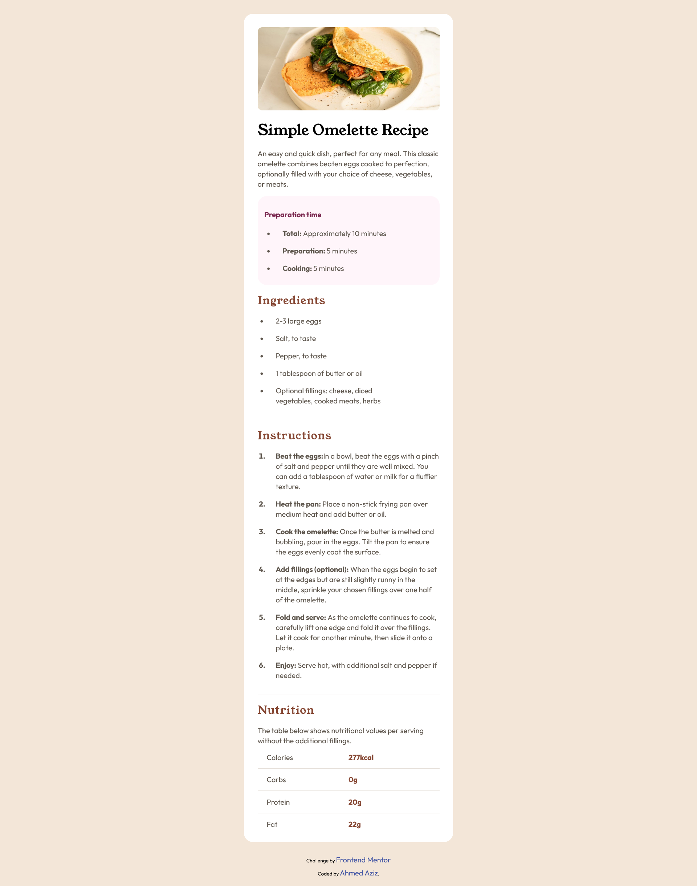

# Frontend Mentor - Recipe page solution

This is a solution to the [Recipe page challenge on Frontend Mentor](https://www.frontendmentor.io/challenges/recipe-page-KiTsR8QQKm). Frontend Mentor challenges help you improve your coding skills by building realistic projects.

## Table of contents

- [Overview](#overview)
  - [Screenshot](#screenshot)
  - [Links](#links)
- [My process](#my-process)
  - [Built with](#built-with)
- [Author](#author)
- [Acknowledgments](#acknowledgments)

**Note: Delete this note and update the table of contents based on what sections you keep.**

## Overview

### Screenshot

### Links

- Solution URL: [Solution Repo](https://github.com/Abo3bazez/Recipe-Page)
- Live Site URL: [Live Site](https://abo3bazez.github.io/Recipe-Page/)

## My process

### Built with

- HTML5 markup
- CSS custom properties
- Flexbox
- Mobile-first workflow
- Bootstrap Breakpoints
- Normalize CSS Library

## Author

- Twitter - [Ahmed Aziz](https://twitter.com/Abo_3bazez)
- Frontend Mentor - [@Abo3bazez](https://www.frontendmentor.io/profile/Abo3bazez)
- GitHub - [Ahmed Aziz](https://github.com/Abo3bazez)

## Acknowledgments

Osama Elzero - Elzero Web School
